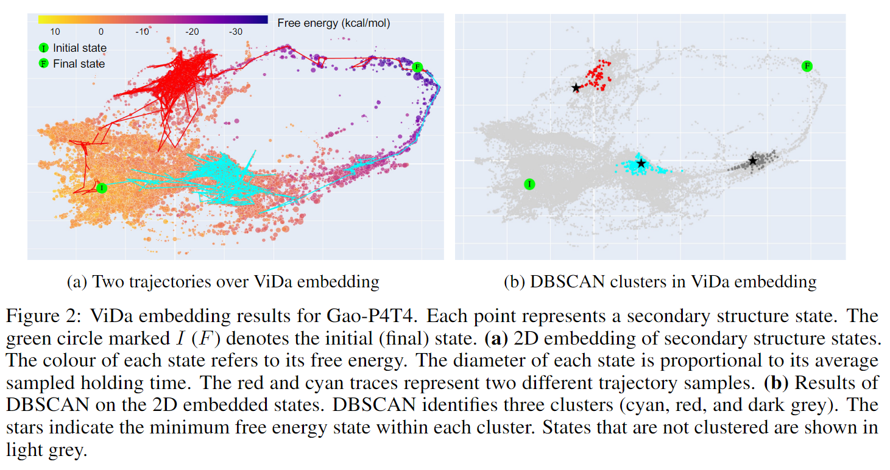

<div align="center">

# ViDa: Visualizing DNA hybridization trajectories with biophysics-informed deep graph embeddings

</div>

<!-- <a href="https://github.com/marktext/marktext/releases/latest">
   
   
   
   
   
</a>      <br> -->


[](https://www.mlsb.io/papers_2022/Visualizing_DNA_reaction_trajectories_with_deep_graph_embedding_approaches.pdf)

ViDa is a visualization tool for DNA reaction trajectories. 
It embeds DNA secondary structures emitted by elementary-step reaction simulators in a 2D landscape, using semi-supervised VAE embedding that leverages domain knowledge (free energy, minimum passage time, and graph edit distance) to determine custom training loss terms.
<br>
ViDa also supports interactive exploration of the landscape and trajectories.

Contact: Chenwei Zhang (cwzhang@cs.ubc.ca)


## About ViDa
Visualization tools can help synthetic biologists and molecular programmers understand the complex reactive pathways of nucleic acid reactions, which can be designed for many potential applications and can be modelled using a continuous-time Markov chain (CTMC). Here we present <b>ViDa</b>, a new visualization approach for DNA reaction trajectories that uses a 2D embedding of the secondary structure state space underlying the CTMC model. To this end, we integrate a scattering transform of the secondary structure adjacency, a variational autoencoder, and a nonlinear dimensionality reduction method. We augment the training loss with domain-specific supervised terms that capture both thermodynamic and kinetic features. We assess ViDa on two well-studied DNA hybridization reactions. Our results demonstrate that the domain-specific features lead to significant quality improvements over the state-of-the-art in DNA state space visualization, successfully separating different folding pathways and thus providing useful insights into dominant reaction mechanisms.

The framework of ViDa is shown below.

   


## Pre-required software

```
Python 3 : https://www.python.org/downloads/  

PyTorch 2.0: 
For Mac: MPS acceleration is available on MacOS 12.3+
$ conda install pytorch::pytorch torchvision torchaudio -c pytorch 
For Linux / Windows:
$ conda install pytorch torchvision torchaudio pytorch-cuda=11.8 -c pytorch -c nvidia
```

## Dependencies
```
numpy==1.24.3
torch==2.1.0
plotly==5.17.0
matplotlib==3.5.1
PyYAML==6.0
tqdm==4.60.0
scikit-learn==1.3.1
networkx==3.1
phate==1.0.11
tensorboard==2.14
```

## Installation
```bash
# clone project   
git clone https://github.com/chenwei-zhang/ViDa

# install vida   
cd ViDa
pip install -e .   
pip install -r requirements.txt
```   
**To install the Multistrand simulator, please follow [Multistrand officila tutorial](https://github.com/DNA-and-Natural-Algorithms-Group/multistrand).**

## Run ViDa in Docker
```bash
# clone project   
git clone https://github.com/chenwei-zhang/ViDa

# install vida iamge by Dockerfile
cd ViDa
docker build -t vida:v1.0.0 .

# create and run docker container from the built image
docker run -it --gpus all --rm vida:v1.0.0 
```   


## Workflow

### Load Multistrand's output data

### Preprocess data

### Construct graph

### Create splits

### Train the model

### Inference using trained model 

### Further dimensionality reduction

### Interactive visualization


## Visualization results

In short, what ViDa does is to biophysical-meaningfully reduce the dimensionality of Multistrand's outputs which are in very very high dimensions. Then visualize the features that are embedded in 2D space.

Here is a simple example of Multistrand's output for a DNA hybridization reaction with strand length of 9.
```bash
$> python run_multistrand.py
--------------------------------------------------------
GCGTTTCAC+GTGAAACGC
.(.......+.......).   t=0.000000 ms, dG=  0.16 kcal/mol
((.......+.......))   t=0.000060 ms, dG= -1.26 kcal/mol
GTGAAACGC+GCGTTTCAC
....(..((+))..)....   t=0.000526 ms, dG=  0.05 kcal/mol
....((.((+)).))....   t=0.000577 ms, dG= -1.46 kcal/mol
...(((.((+)).)))...   t=0.000608 ms, dG= -2.73 kcal/mol
...((((((+))))))...   t=0.000858 ms, dG= -7.90 kcal/mol
..(((((((+)))))))..   t=0.001025 ms, dG=-10.74 kcal/mol
.((((((((+)))))))).   t=0.001374 ms, dG= -9.79 kcal/mol
..(((((((+)))))))..   t=0.001421 ms, dG=-10.74 kcal/mol
.((((((((+)))))))).   t=0.002326 ms, dG= -9.79 kcal/mol
..(((((((+)))))))..   t=0.002601 ms, dG=-10.74 kcal/mol
..((((((.+.))))))..   t=0.002988 ms, dG= -9.33 kcal/mol
..(((((((+)))))))..   t=0.003122 ms, dG=-10.74 kcal/mol
..((((((.+.))))))..   t=0.003430 ms, dG= -9.33 kcal/mol
..(((((((+)))))))..   t=0.003570 ms, dG=-10.74 kcal/mol
..((((((.+.))))))..   t=0.003705 ms, dG= -9.33 kcal/mol
..(((((((+)))))))..   t=0.004507 ms, dG=-10.74 kcal/mol
..((((((.+.))))))..   t=0.006064 ms, dG= -9.33 kcal/mol
..(((((((+)))))))..   t=0.006210 ms, dG=-10.74 kcal/mol
..((((((.+.))))))..   t=0.006919 ms, dG= -9.33 kcal/mol
.(((((((.+.))))))).   t=0.007772 ms, dG= -8.37 kcal/mol
((((((((.+.))))))))   t=0.007780 ms, dG=-10.96 kcal/mol
(((((((((+)))))))))   t=0.008021 ms, dG=-12.38 kcal/mol
```

Here's the ViDa's visualization for the high-dimensional output features.
> **Visualization plots by ViDa for two different reactions**  
<div style="text-align:left">
    
</div>
<div style="text-align:left">
    
</div>

Here's the state-of-the-art coarse-grained (CG) method's visualization.
> **Visualization plots by CG for reaction Gao-P4T4**
<div style="text-align:center">
    
</div>

By comparison, we find that in the plot made by CG, each macrostate is an ensemble of secondary structures. However, with this scheme, structurally dissimilar secondary structures may be mapped to the same macrostate, making it difficult to interpret each macrostate and trajectories through them, and to distinguish between different reaction mechanisms. In contrast, ViDa's fine-grained embedding overcomes this limitation. ViDa's plots show distinct reaction trajectories, enabling users to interpret reaction mechanisms more straightforwardly and accurately. 

## Citation   
```
@inproceedings{Zhang-etal-2022,
  title={Visualizing {DNA} reaction trajectories with deep graph embedding approaches},
  author={Zhang, Chenwei and Dao Duc, Khanh and Condon, Anne},
  booktitle={Machine Learning for Structural Biology Workshop, NeurIPS},
  year={2022}
}
```   
